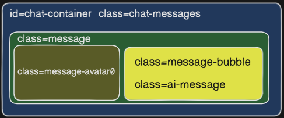

# MCP Host（Jii Chat）
Supply essential UI layouts to assist programmers in designing AI interfaces, built with Go and HTMX.An application (like an AI tool or IDE) that uses MCP to get data.

## HTML Message class

## LLM lists
Vision: llama3.2-vision:latest